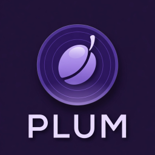

<p align="center">
  
</p>

# Plum 🫐

Plum is a lightweight, experimental media server and player suite inspired by platforms like Plex and Jellyfin. It features a high-performance Go backend for media management and transcoding, paired with a modern React frontend for a seamless viewing experience.

## ✨ Features

- **Media Library:** Browse your media collection with a clean, responsive UI.
- **Real-time Transcoding:** Initiate and monitor transcoding tasks directly from the player.
- **Live Updates:** WebSocket integration provides instant feedback on server-side tasks.
- **Lightweight & Portable:** Uses SQLite for zero-configuration database management.
- **Cross-Platform:** Built with Go and React to run anywhere.

## 📁 Project Structure

This project is organized as a monorepo using Bun workspaces:

- `apps/server`: [Go](https://go.dev/) (Golang) backend for media management and transcoding.
- `apps/web`: [React](https://react.dev/) / [Vite](https://vitejs.dev/) frontend for a seamless viewing experience.
- `apps/desktop`: [Electron](https://www.electronjs.org/) (WIP) wrapper for native desktop experience.
- `packages/contracts`: Shared TypeScript contracts and schemas using [Effect](https://effect.website/).
- `packages/shared`: Shared runtime utilities for web and desktop.

## 🛠 Tech Stack

- **Backend:** Go, SQLite (via `modernc.org/sqlite`), REST, WebSockets.
- **Frontend:** React, TypeScript, Vite, Effect.
- **Monorepo:** Bun workspaces.

## 🚀 Getting Started

### Prerequisites

- [Docker](https://docs.docker.com/get-docker/) & [Docker Compose](https://docs.docker.com/compose/install/)
- [Bun](https://bun.sh/) (Optional, for local frontend development)
- [Go](https://go.dev/) (Optional, for local backend development)

### Quick Start with Docker

The easiest way to get started is using the provided `Makefile`:

```bash
# Start full stack in development mode (with hot-reloading)
make dev
```

The frontend will be available at `http://localhost:5173` and the backend at `http://localhost:8080`.

### Other Commands

- `make build` - 🔨 Build all Docker images
- `make up` - ⬆️  Start services in background
- `make down` - ⬇️  Stop all services
- `make lint` - 🔍 Lint both backend and frontend
- `make fmt` - 🎨 Format both backend and frontend
- `make test` - 🧪 Run backend tests

## ⚙️ Configuration

### Backend Environment Variables

- `PLUM_ADDR`: The address and port to listen on (default: `:8080`).
- `PLUM_DATABASE_URL`: Path to the SQLite database file (default: `./data/plum.db`; in Docker use `/data/plum.db`).

### Frontend Environment Variables

- `VITE_API_URL`: The API URL for the backend (default: `http://localhost:8080`).
- `VITE_WS_URL`: The WebSocket URL for the backend (defaults to `ws://localhost:8080/ws` in development).

## 🗺 Roadmap

- [ ] Automatic library scanning
- [ ] Multiple library support (Movies, TV Shows, Music)
- [ ] User authentication and profiles
- [ ] Advanced transcoding options (bitrate, resolution)
- [ ] Mobile-optimized player

## 📄 License

MIT
